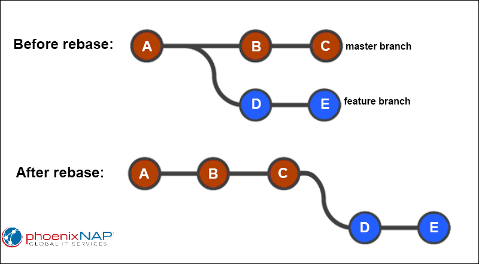

# Pull Requests!

When you develop something and want to add it to the main branch you can't push it directly to the main branch -- instead you have to create a pull requst to merge or rebase changes in your branch onto main. 
 - For FRC we will only use merge with creating pull requests but it's also important to know the difference between merge and rebase and what you should use in the future. (read below!)
 - To open a pull request, go to the repo in question and:
    - Select on the pull request tab at the top navigation area of the repo:
       -  
    - Then, in the pr section, select `create a new pull request` and select the two branches in question. (base is main, compare is dev branch)
       - 
    - Add comments accordingly into the pr, and send it out.
- The pr's for robotics will typically be accompanied by reviewers who will leave comments on the pr's before they can be approved. Periodically check on your pr's and ensure whatever code changes are being suggested in the comments are being looked at. Once all comments on the pr are resolved, the pr will be approved, and you will have merged the two branches!

# Merge vs Rebase 

Heads up: rebasing is messy business and *merge v rebase* is a hard topic for some. To get a better grasp visually, i recommend videos like [this one](https://www.youtube.com/watch?v=zOnwgxiC0OA).

`git rebase` and `git merge` are designed to integrate changes from one branch into another branch:

Consider what happens when you start working on a new feature in a dedicated branch, then another team member updates the `main` branch with new commits. This results in a **forked history**:


To incorporate the new commits from `main` into your `feature` branch, you have two options: merging or rebasing.

### Merge :grin:

To merge the `main` branch into the feature branch, use something like the following:

```
git checkout feature
git merge main
```

This creates a new "merge commit" in the `feature` branch that ties together the histories of both branches, giving you a branch structure that looks like this:


> [!NOTE]
> Merging is *nondestructive*, so there will be no change to the code on either branch.

> [!WARNING]
> The `feature` branch will have an extraneous merge commit every time you need to incorporate upstream changes.
- `main` is very active => can pollute your feature branch's history
- `rebase` can lead to a cleaner commit history for a certain feature's branch!

### Rebase :fearful:

You can rebase the `feature` branch onto `main` branch using the following commands:

```
git checkout feature
git rebase main
```

This moves the entire `feature` branch to begin on the tip of the `main` branch, effectively incorporating all of the new commits in `main`.
- Instead of using a merge commit, rebasing *re-writes* the project history by creating brand new commits for each commit in the original branch.
    - To not get into the nitty gritty, this means it changes the commit hashes -- 



Rebase benefits:
- Linear project history (start to finish, everything is one in commit log!)
- No extraneous merge commit

IMPORTANT DISCLAIMERS FOR REBASING:
- Never rebase commits that have been pushed and shared with others.
   - Only exception to this rule is when you are certain no one on your team is using the commits or the branch you pushed.

- Use rebase to catch up with the commits on another branch as you work with a local feature branch.
   - Especially useful when working in long-running feature branches to check how your changes work with the latest updates on the main branch.

- Can’t update a published branch with a push after you've rebased the local branch
   - Need to force push the branch to rewrite the history of the remote branch to match the local history

All this said, rebasing gets messy! especially as it will often involve force pushes (why? food for thought :thinking::pizza:), which can be extremely dangerous. ALWAYS be careful with rebasing. 
- We use rebasing when creating pull requests in FRC which helps us keep a cleaner commit history which is easier to navigate. 
- You may also *interactive rebase + squash* before a pull request (check git cheat sheet for this!)
- You'll more often find that we MERGE or CHERRY-PICK subsystem test branches' changes onto the main dev branch. 

---
